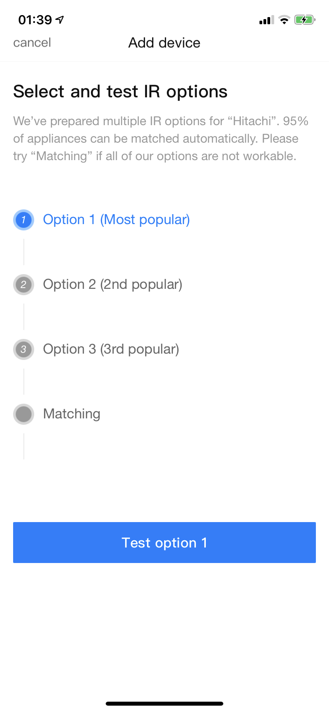
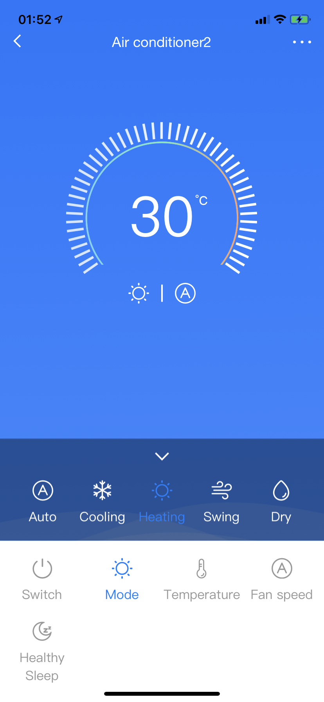
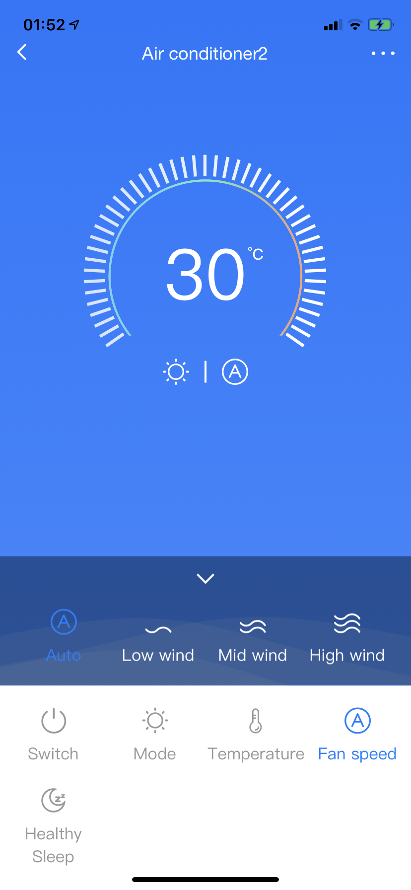

# Reverse Engineering Hitachi IR Remote Code
I found a integration [smartHomeHub/SmartIR](https://github.com/smartHomeHub/SmartIR), it looks great, but default config file of Hitachi AC not match my AC, and Broadlink app has a code set works good for me (and should good for most Hitachi). So I tried to take out the commands.


## Get code from Broadlink

- In Broadlink app, the most popular IR remote option of Hitachi air conditioner is the `Option 1`. It has:
    + 5 mode: Auto, Cooling, Heating, Swing, Dry
    + 4 fan: Auto, Low, Mid, High 

  

- I've wrote this [Extract_BroadLink_learned_codes_from_iOS_App](https://github.com/Erimus-Koo/Extract_BroadLink_learned_codes_from_iOS_App). Put many command into scene, and export as `broadlink_codes.txt`.


## Analyze code

- Most of the IR code of Aircon is combined with different part of mode / fan / temperature. I've tried to find the rules like serialized numbers map to mode, but I failed. So I just pick out the different part, the index and content. Just like:

```
===========
analyze_fan
===========
          830 831 834 835 838 839 862 863 866 867 870 871
Auto        2   6   0   b   2   6   0   b   2   6   0   b
Low wind    0   b   2   6   0   b   2   6   0   b   2   6
Mid wind    2   6   2   6   0   b   0   b   0   b   2   6
High wind   0   b   0   b   2   6   2   6   2   6   0   b
```

- The `Auto` and `Swing` mode will ignore the temperature setting, but fan mode still affects.
- Use `analyze_source_code.py`, I export the result of different as `reversed_code.json`


## Generate config file

- [smartHomeHub/SmartIR](https://github.com/smartHomeHub/SmartIR) will download some config file of device code.  
- Base on it, use `generate_code.py` to get a new config file `1084.json` (follow the device code of Hitachi).
- I've checked some generated commands, compared to Broadlink's, they are same. But I can not check all the commands (my AC do not has a panel to display the states), I think it should works.
